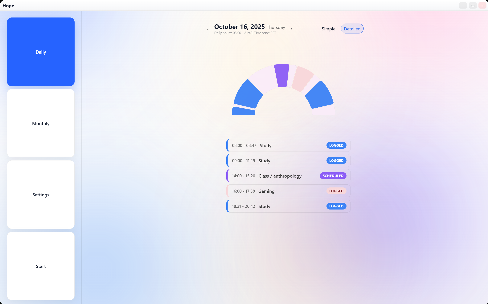
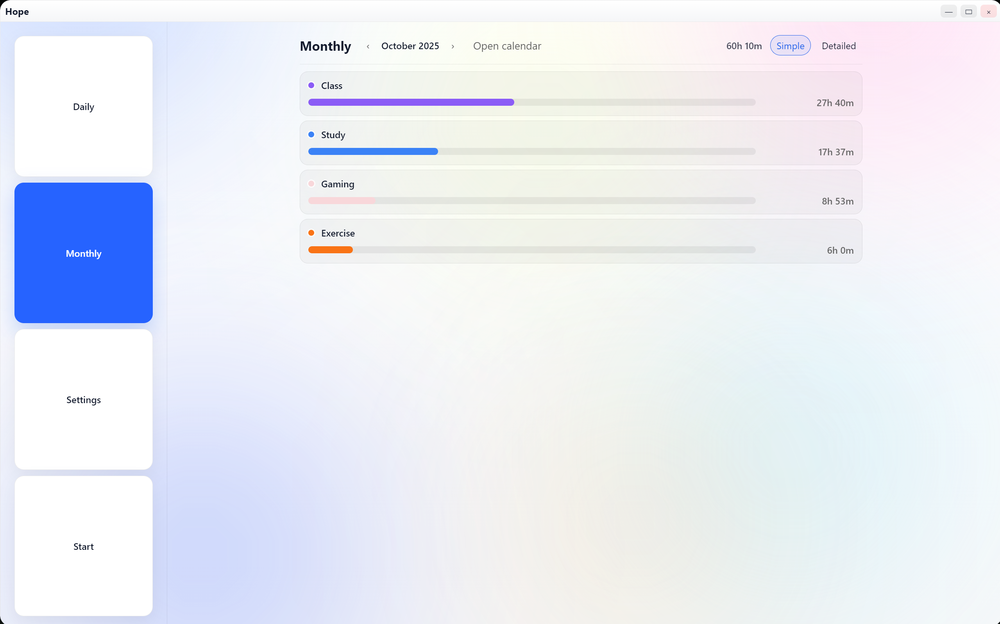
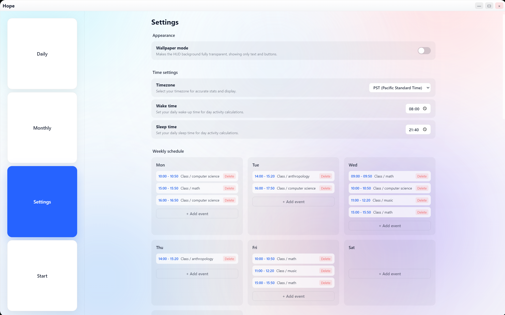
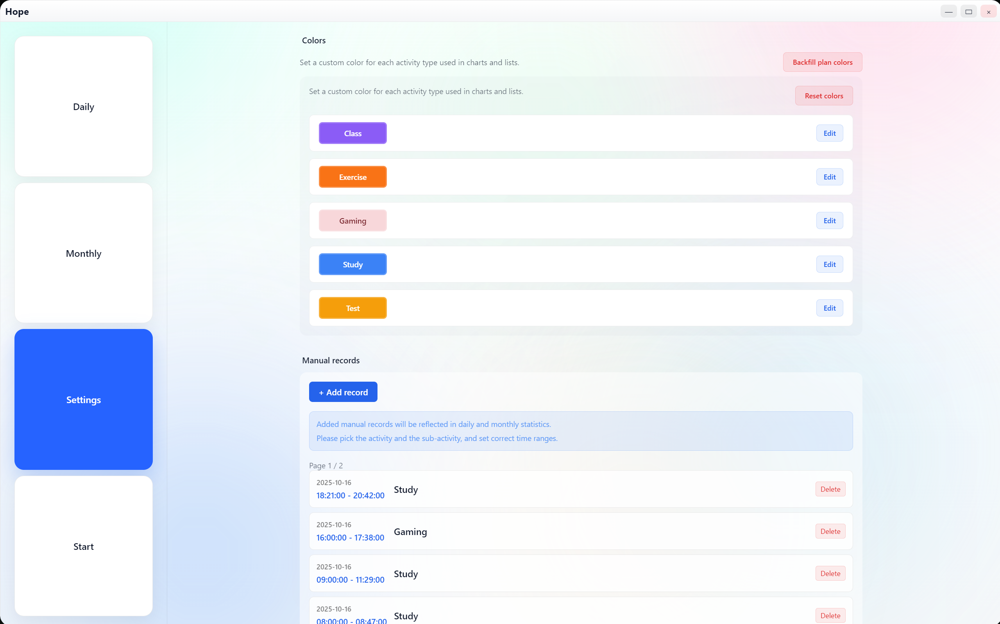
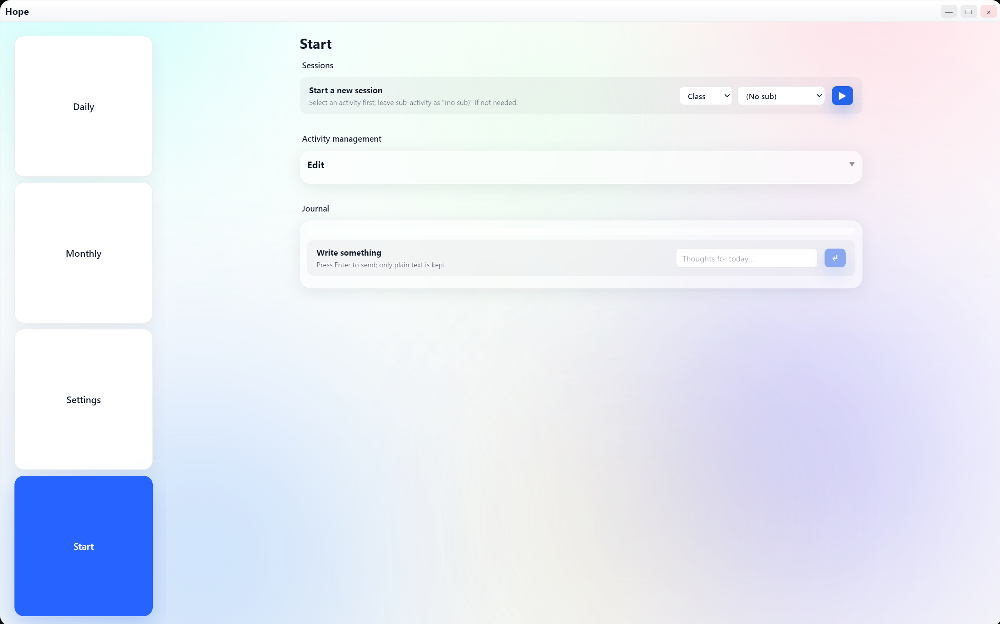

# Hope – A Minimalist Time Tracker ⏳
*A calm, glassmorphic desktop app for focus and self-discipline.*

---

## 🌟 Overview
**Hope** is a local-first time-tracking app built with **Electron + React + SQLite**, designed to make productivity elegant and lightweight.  
It helps you visualize your work rhythm through beautiful daily and monthly arcs.



---

## ✨ Features
- 🕒 **HUD Timer** — floating overlay for real-time focus tracking  
- 📊 **Daily & Monthly Stats** — visualize progress with arc charts  
- 💾 **Local Storage Only** — all data stays offline (SQLite-based)  
- ⚙️ **Customizable Start Center** — create and manage activities easily  
- 🎨 **Glassmorphism UI** — soft gradients, gentle blur, and modern minimalism  

---

## 🧠 Tech Stack
| Layer | Technology |
|--------|-------------|
| **Frontend** | React + TypeScript + Vite |
| **Desktop Runtime** | Electron |
| **Database** | better-sqlite3 |
| **Styling** | TailwindCSS + Custom CSS (Glassmorphism) |
| **Build** | Electron Builder |
| **Dev Tools** | VS Code + GitHub Copilot + ESLint |

---

## 📸 Screenshots

| Daily | Monthly | RunHUD | RunHUD (Overlay) |
|:------:|:--------:|:--------:|:----------------:|
|  |  |  |  |

| Settings | Settings (Advanced) | Start Center |
|:----------:|:------------------:|:-------------:|
|  |  |  |

---

## 🚀 Getting Started

### Clone & Run
```bash
git clone https://github.com/dan9574/hope-time-tracker.git
cd hope-time-tracker
npm install
npm run dev
```

### Build Desktop App
```bash
npm run build
```

---

## 💡 Philosophy
> “Time feels different when it’s seen beautifully.”  

Hope aims to transform daily tracking into a quiet ritual of reflection.  
Every session, every pause, and every return tells the story of how you build focus.

---

## 🧭 Notes
> ⚠️ Currently, time display may behave unexpectedly under non-local timezones (e.g., BST).  
> This will be addressed in a later release.  

Localization for Chinese is planned for a future version.
---

## 📄 License
MIT © 2025 dan9574
