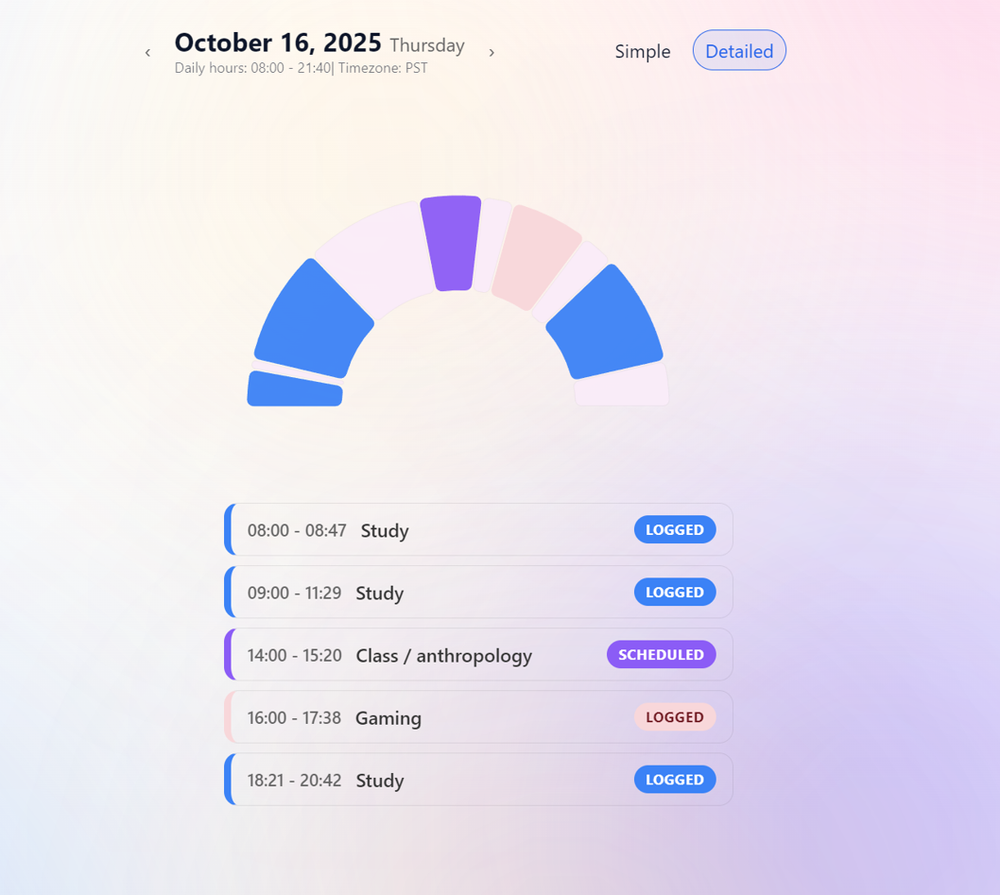
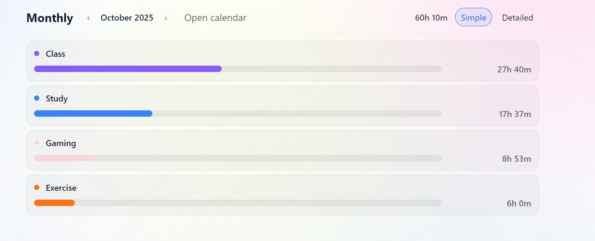
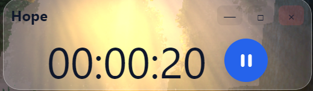
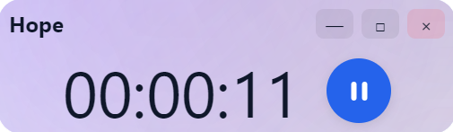

<div align="center">

# Hope – A Minimalist Time Tracker ⏳  
*A calm, glassmorphic desktop app designed to visualize your focus.*

[](https://github.com/dan9574/hope-time-tracker/stargazers)
[](https://github.com/dan9574/hope-time-tracker/issues)
[](LICENSE)
[](https://github.com/dan9574/hope-time-tracker/releases)

</div>

---

## 🌟 Overview
**Hope** transforms your daily work into elegant visual arcs — turning time tracking into a ritual of awareness and clarity.

> “See your time, feel your focus.”

---

## ✨ Highlights

### 🕒 Visualize Your Time
See exactly **what you did while awake** — with smooth semi-ring progress arcs that bring focus to life.

<p align="center">
  
</p>

---

### 📊 Understand Your Month
A clean, intuitive monthly breakdown shows **where your hours truly went** across all projects.

<p align="center">
  
</p>

---

### 🎨 Two Timer Modes
Choose between two immersive HUD styles:

| Transparent (subtle overlay) | Gradient (vivid, modern) |
|:----------------------------:|:-------------------------:|
|  |  |

---

## ⚙️ Smart Settings
- Add **recurring events** that auto-fill your schedule  
- Customize **ring colors** and **manually add missed sessions**  
*(Settings preview intentionally omitted for clarity.)*

---

## 🧠 Tech Stack
**Electron · React · TypeScript · Vite · SQLite · TailwindCSS**

---

## 🚀 Getting Started

### Clone & Run
```bash
git clone https://github.com/dan9574/hope-time-tracker.git
cd hope-time-tracker
npm install
npm run dev
```

### Build Desktop App
```bash
npm run build
```

---

## 💡 Philosophy
> “Time feels different when it’s seen beautifully.”  
Hope helps you **see productivity as an art form** — balancing calm design with meaningful awareness.

---

## 🧭 Notes
> ⚠️ Time display may behave unexpectedly under non-local timezones (e.g., BST).  
> This will be addressed in a later release.

---

## 📄 License
MIT © 2025 dan9574

<p align="right"><a href="#hope--a-minimalist-time-tracker-">↑ Back to top</a></p>
